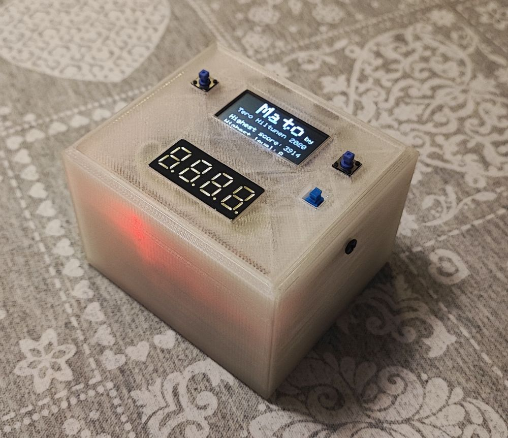
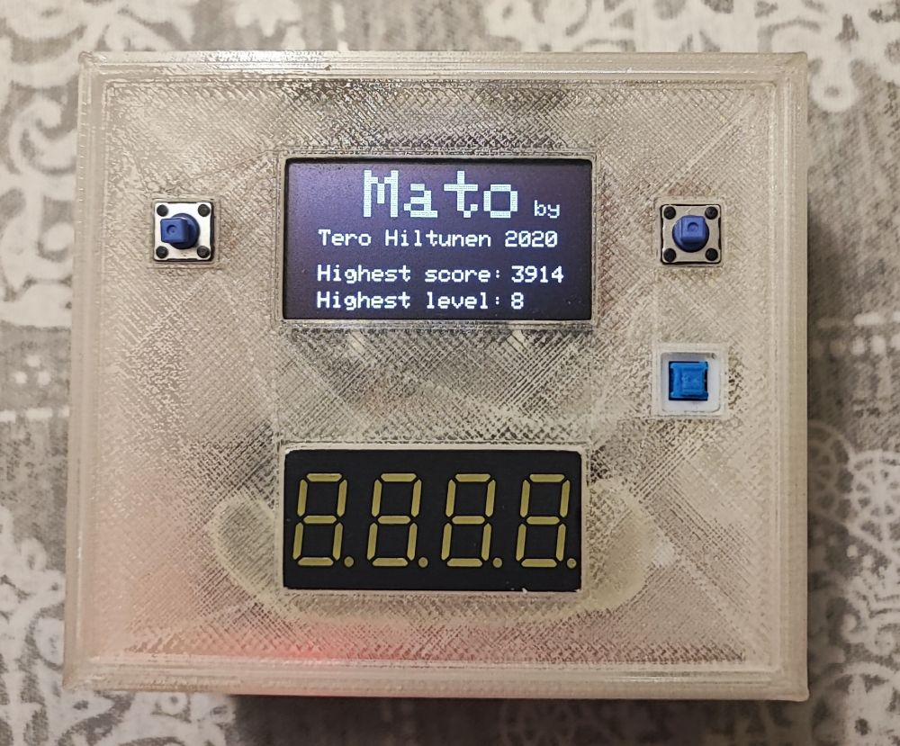
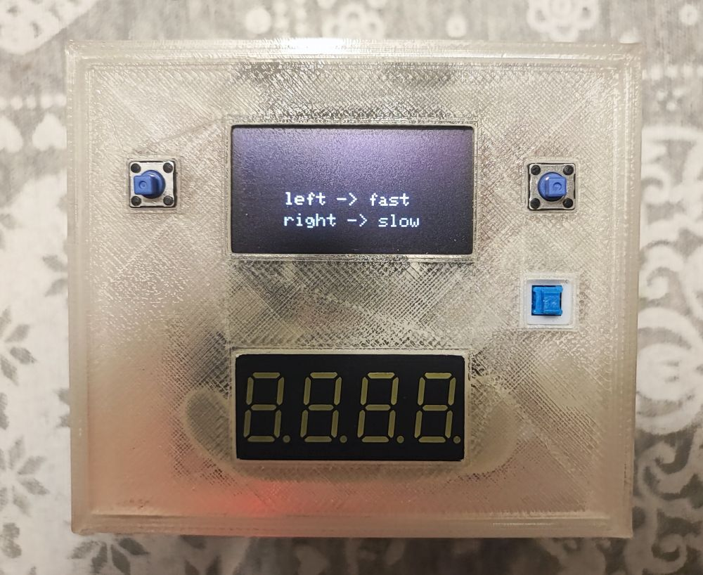
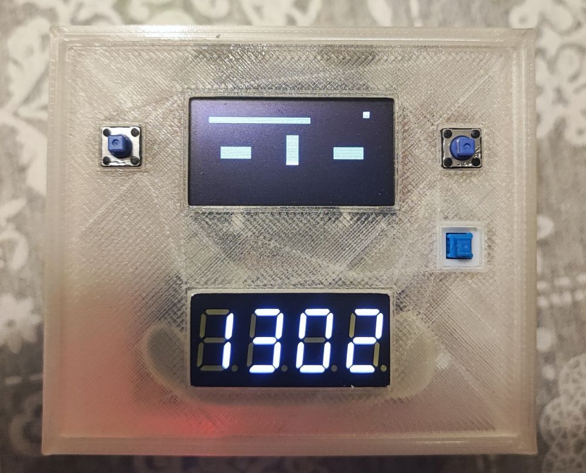
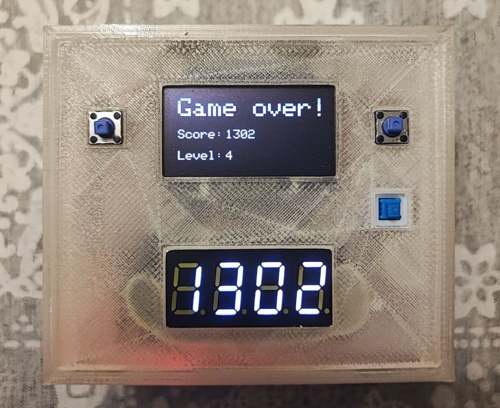

# Mato
Arduino nano microcontroller worm game. The project is coded using the Arduino IDE. 

## Features
- Arduino nano microcontroller.
- Two displays. Small OLED display and a separate 7 segment score display.
- Three buttons. Power button and two buttons for turning the worm.
- Little sound beeper.
- Powered with three AAA batteries.
- 3D printed case.
- Two speed levels. Slow and fast.
- "Infinite" number of levels. Each level increases the worm's speed or adds obstacles. When the worm is long enough, the level changes to the next one. 
- The highest score and level are permanently stored in EEPROM memory. 
## Photos

